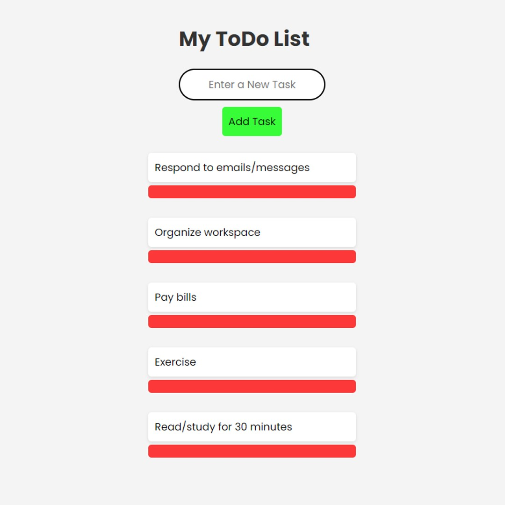

# ToDo List

This is a simple and intuitive To-Do list application built using HTML, CSS, and JavaScript. This project allows users to create, manage, and delete tasks efficiently with a user-friendly interface.

## Features

- **Add Task**: Users can add new tasks to the list using the input box and "Add Task" button.
- **Delete Task**: Each task comes with a delete button, allowing users to easily remove tasks when completed.
- **Keyboard Shortcuts**: Press "Enter" after typing a task to quickly add it to the list.
- **Simple UI**: The interface is minimalistic and clean, focusing on usability.

## Demo

You can try the live version of this program at the following link:

[**Live Demo**](https://simple-todo-list-one-delta.vercel.app/)

## How to Use

1. **Add a Task**:
   - Enter a task in the input field labeled "Enter a New Task."
   - Click the "Add Task" button, or press "Enter" to add the task to the list.
   
2. **Delete a Task**:
   - Once a task is added, a delete button will appear next to it.
   - Click the delete button to remove the task from the list.

## Technologies Used

- **HTML**: Structuring the web page.
- **CSS**: Styling the to-do list with a clean and responsive design.
- **JavaScript**: Adding interactivity like creating, deleting tasks, and handling user inputs.

